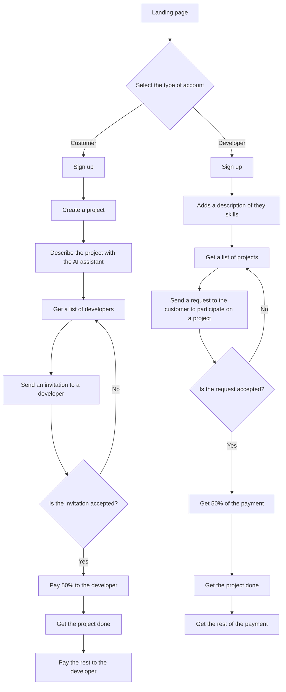

```mermaid
graph TD;
    A[Landing page]
    A-->B;
    B{Select the type of account}

    B-->|Customer|CA[Sign up]
    CA-->CB[Create a project]
    CB-->CD[Describe the project with the AI assistant]
    CD-->CE[Get a list of developers]
    CE-->CF[Send an invitation to a developer]
    CF-->CG{Is the invitation accepted?}
    CG-->|No|CE
    CG-->|Yes|CH[Pay 50% to the developer]
    CH-->CI[Get the project done]
    CI-->CJ[Pay the rest to the developer]


    B-->|Developer|DA[Sign up]
    DA-->DB[Adds a description of they skills]
    DB-->DC[Get a list of projects]
    DC-->DD[Send a request to the customer to participate on a project]
    DD-->DE{Is the request accepted?}
    DE-->|No|DC
    DE-->|Yes|DF[Get 50% of the payment]
    DF-->DG[Get the project done]
    DG-->DH[Get the rest of the payment]


```
